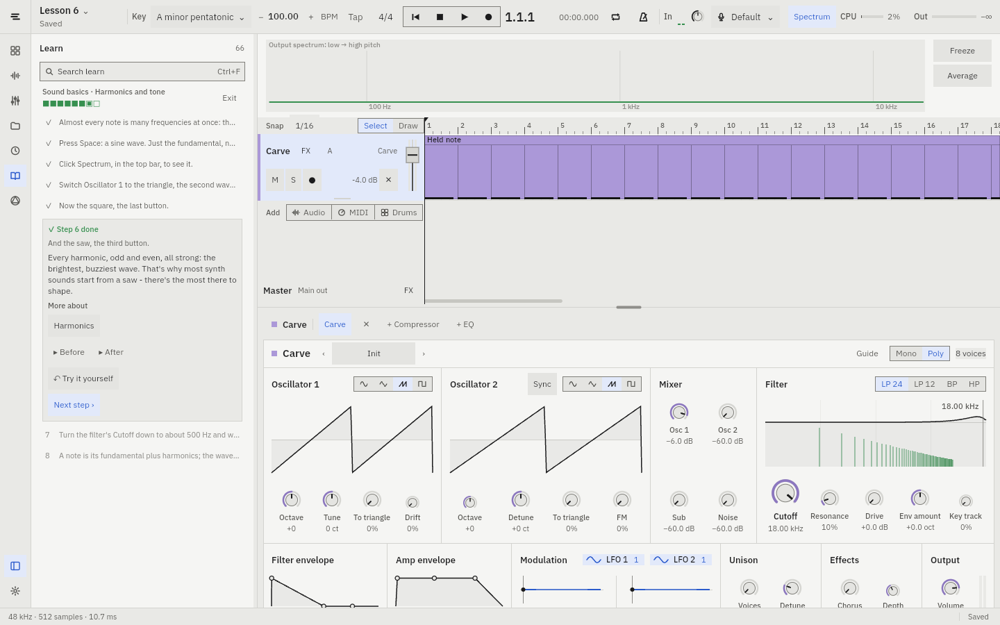
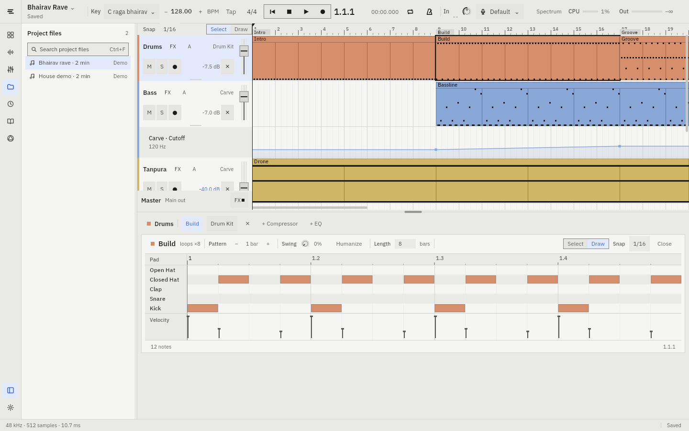

# Shor

A small DAW written in Rust, built to teach people how to make music. It has a
subtractive synth, a drum kit, audio recording, and 66 hands-on lessons that
run inside the app.





## What's in it

- **Arrangement:** audio and MIDI tracks, looping and linked clips,
  markers, split and duplicate, full undo. Every track's fader has a level
  meter built in.
- **Automation:** the A button on a track lists every knob it can move (the
  last one you turned first); right-clicking any knob works too.
- **Carve:** a subtractive synth with two oscillators, sub, noise, filter,
  envelopes, two LFOs, unison, chorus and reverb, plus presets. The
  displays show what each control does: the wave bends as you turn Shape,
  and the filter curve is drawn over the sound's own harmonics.
- **Drum Kit:** a step sequencer - paint and erase steps with one drag,
  accents and ghost notes, swing, Humanize, 1/32 and triplet rolls - with
  per-pad mute, level and tuning.
- **Piano roll:** shows the song's key (scale notes, sargam or intervals),
  one-click chords, and moves notes by scale step or octave from the
  keyboard.
- **Effects:** a compressor and a four-band EQ (low cut, shelves, bell) on
  every track and on the master bus.
- **Recording:** record from any audio input, like a guitar interface or a mic.
- **Browser:** samples, presets, instruments and effects, with preview,
  collections, and a *Fits key* filter that hides samples that would clash
  with your song's key.
- **Spectrum analyzer** and **WAV export**.
- **Learn:** 66 interactive lessons that run in the sidebar beside the
  controls they point at. Each step checks itself, glows the control to use,
  can be shown to you ("Show me"), then pauses to explain why it sounds the
  way it does, with Before / After to hear the difference. "More" opens the
  deeper story behind ideas like decibels, harmonics or resonance.
  - Beats, bass and chords.
  - Sound basics: loudness and decibels, pitch and frequency, harmonics and tone.
  - Piano roll and step sequencer: accents and ghost notes, note length and
    timing, painting beats, swing, hi-hat rolls.
  - Theory: octaves, scales, keys, major and minor, intervals by ear, triads,
    progressions, melody over chords, 7th chords, raag basics (with sargam
    note names).
  - Melody: steps and leaps, call and response, motifs.
  - Carve from waves to sound recipes (flute, tanpura, lo-fi keys...).
  - Mixing: levels, EQ, compression, and finishing a mix.
  - How house and raag-based tracks are arranged.
  - Full projects: a house track, a lo-fi beat, Bollywood lo-fi, desi trap.
  - *Sound match*: read a sound's spectrum, then rebuild it.
- **Two demo songs:** a two-minute house track and a Raag Bhairav rave.

## Run

```
cargo run --release -p ui
```

Needs Rust 1.85+. Runs on macOS and Linux (Linux needs ALSA development
headers, and `zenity` for file dialogs).

| Key | Does |
| --- | --- |
| Space | Play / stop |
| Ctrl/⌘ S, Z, Shift+Z | Save, undo, redo |
| Ctrl/⌘ E | Split clips at the playhead |
| Ctrl/⌘ B | Show or hide the sidebar panel |
| Ctrl/⌘ F | Search the browser |
| Ctrl/⌘ T | Cycle themes: Studio, Daylight, Midnight, High contrast, Paper |
| Ctrl/⌘ +, −, 0 | Zoom the whole UI in, out, back to 100% (also in Settings) |

## Package for macOS

On a Mac, `scripts/make-dmg.sh` builds `target/dmg/Shor-<version>.dmg`: the
app for Apple silicon and Intel, with the shipped samples. Unsigned, macOS
warns on first open (System Settings > Privacy & Security > Open Anyway);
set `SIGN_ID` (and `NOTARY_PROFILE`) to sign and notarize it - see the
script. An installed copy keeps settings, projects and recordings in
`~/Library/Application Support/Shor`.

## Code

- `engine`: the real-time audio thread (cpal). It plays the arrangement,
  the synth and the drum voices, and renders offline for export and
  previews.
- `shared`: the project model, undo commands, the synth's parameters,
  lessons' starting projects, and sound analysis. Plain Rust with no UI
  code, well tested.
- `ui`: the [Vizia](https://github.com/vizia/vizia) app.
- `design/`: the design tokens and specs. `ui/build.rs` generates the
  stylesheets and colour palette from `design/tokens.json`.

```
cargo test --workspace
```
