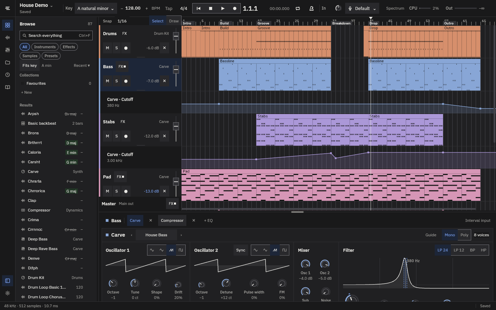
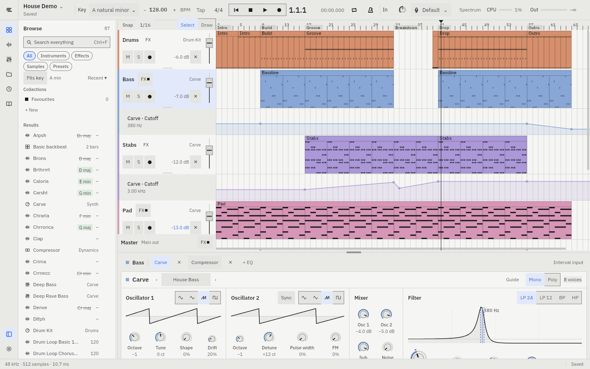

# Strata

A small DAW written in Rust, built to teach people how to make music. It has a
subtractive synth, a drum kit, audio recording, and 36 hands-on lessons that
run inside the app.




## What's in it

- **Arrangement:** audio and MIDI tracks, looping and linked clips,
  automation, markers, split and duplicate, full undo.
- **Carve:** a subtractive synth with two oscillators, sub, noise, filter,
  envelopes, two LFOs, unison, chorus and reverb, plus presets.
- **Drum Kit:** a step grid, and a piano roll that shows the song's key.
- **Effects:** a compressor and an EQ on every track and on the master bus.
- **Recording:** record from any audio input, like a guitar interface or a mic.
- **Browser:** samples, presets, instruments and effects, with preview,
  collections, and a *Fits key* filter that hides samples that would clash
  with your song's key.
- **Spectrum analyzer** and **WAV export**.
- **Learn:** interactive lessons that check your work as you go.
  - Beats, bass and chords.
  - Carve from waves to sound recipes (flute, tanpura, lo-fi keys...).
  - How house and raag-based tracks are arranged.
  - Full projects: a house track, a lo-fi beat, Bollywood lo-fi.
  - *Sound match*: read a sound's spectrum, then rebuild it.
- **Two demo songs:** a two-minute house track and a Raag Bhairav rave.

## Run

```
cargo run --release -p ui
```

Needs Rust 1.85+. Runs on macOS and Linux (Linux needs ALSA development
headers, and `zenity` for file dialogs).

| Key | Does |
| --- | --- |
| Space | Play / stop |
| Ctrl/⌘ S, Z, Shift+Z | Save, undo, redo |
| Ctrl/⌘ E | Split clips at the playhead |
| Ctrl/⌘ B | Show or hide the sidebar panel |
| Ctrl/⌘ F | Search the browser |
| Ctrl/⌘ T | Switch between the Studio (dark) and Daylight themes |

## Code

- `engine`: the real-time audio thread (cpal). It plays the arrangement,
  the synth and the drum voices, and renders offline for export and
  previews.
- `shared`: the project model, undo commands, the synth's parameters,
  lessons' starting projects, and sound analysis. Plain Rust with no UI
  code, well tested.
- `ui`: the [Vizia](https://github.com/vizia/vizia) app.
- `design/`: the design tokens and specs. `ui/build.rs` generates the
  stylesheets and colour palette from `design/tokens.json`.

```
cargo test --workspace
```
