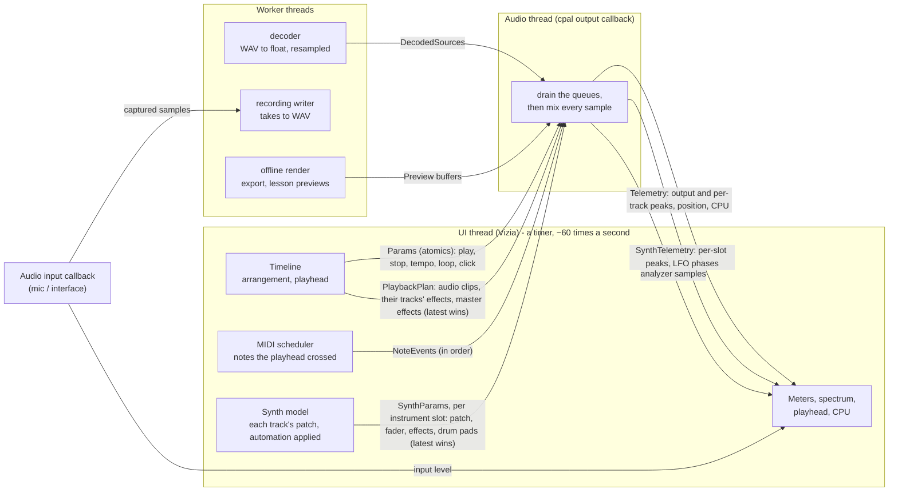
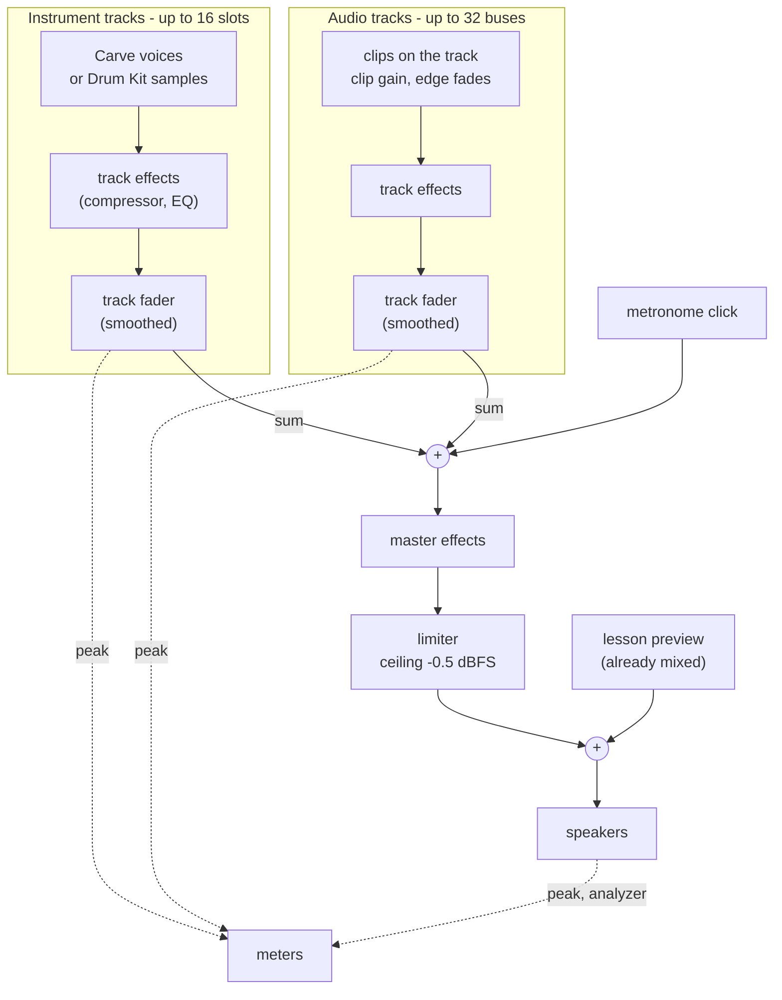

# How Shor's audio engine works

A high-level map: which threads there are, how the UI talks to the audio
thread, and how one sample of the mix is made. Code: `engine/src/lib.rs`
(the callback and `write_block`), `shared/src/lib.rs` and `shared/src/synth/bridge.rs`,
`shared/src/playback.rs` (what crosses between threads), `ui/src/main.rs`
(the UI's ~60 Hz timer that feeds it).

## The threads

Every arrow into the audio thread is a lock-free ring buffer (`rtrb`) or
an atomic: the callback never waits on a lock, allocates, or makes a
system call (one bounded exception: swapping in a new `PlaybackPlan`
frees the old one's list - see `shared::playback`). "Latest wins" queues
are drained and only the newest item kept; notes and decoded sources are
applied in order.

Two things the UI thread does, not the engine - so they're only as
precise as its ~16 ms timer:

- **MIDI notes**: `ui/src/timeline/scheduler.rs` sends note on/off for
  the notes the playhead crossed since the last frame.
- **Automation**: evaluated at the playhead each frame and sent as new
  `SynthParams` / plans (track gain glides, so steps don't click).

Moving both into the callback (sample-accurate) is the known next step
if timing ever needs to be tighter.

## One sample of the mix (`write_block`)

In order, for every sample of the block:

1. **Instrument slots.** Each track with Carve or a Drum Kit owns a slot.
   Its voices (or drum samples) play, then its effect chain, then its
   fader - the fader glides to new values over a few milliseconds, so
   moving it or automating it doesn't click. The slot's peak after the
   fader is what that track's header meter shows.
2. **Click.** A short sine blip on each beat when the metronome is on.
3. **Audio tracks.** Clips sounding at this position are read from their
   decoded sources (already converted to the engine's sample rate), with
   their clip gain and a short fade at each edge, summed per track, then
   through the track's effects and fader. Per-track peaks feed the meters.
4. **Master.** Everything summed, through the master effect chain, then a
   limiter so nothing leaves louder than -0.5 dBFS.
5. **Preview.** A lesson's Before / After / Hear the goal clip, rendered
   earlier off the audio thread, is added last.
6. **Out.** Written to the device; the peak and a copy for the spectrum
   analyzer go back to the UI.
7. **Transport.** If playing, the sample counter moves on, and wraps to
   the loop start at the loop's end. Everything position-dependent reads
   that one counter.

After the block: the peaks, position and CPU load (time spent / time
available) are pushed back to the UI - which is where the playhead, the
meters and the CPU readout come from.

## Offline rendering

Export and lesson previews use the same DSP code
(`engine/src/render.rs`): the same slots, buses, effects and limiter,
run as fast as the computer can instead of in real time, with notes
scheduled exactly - so an export sounds like playback, only tighter.

## Recording

The input device has its own callback. It sends each block's samples to
a writer thread that appends them to a WAV file (so the audio callback
never touches the disk), and its level to the input meter. When the take
stops, the file is decoded like any other source and becomes a clip.
There's no input monitoring yet: you don't hear yourself through the
track's effects while recording (see `docs/guitar-track.md`).
